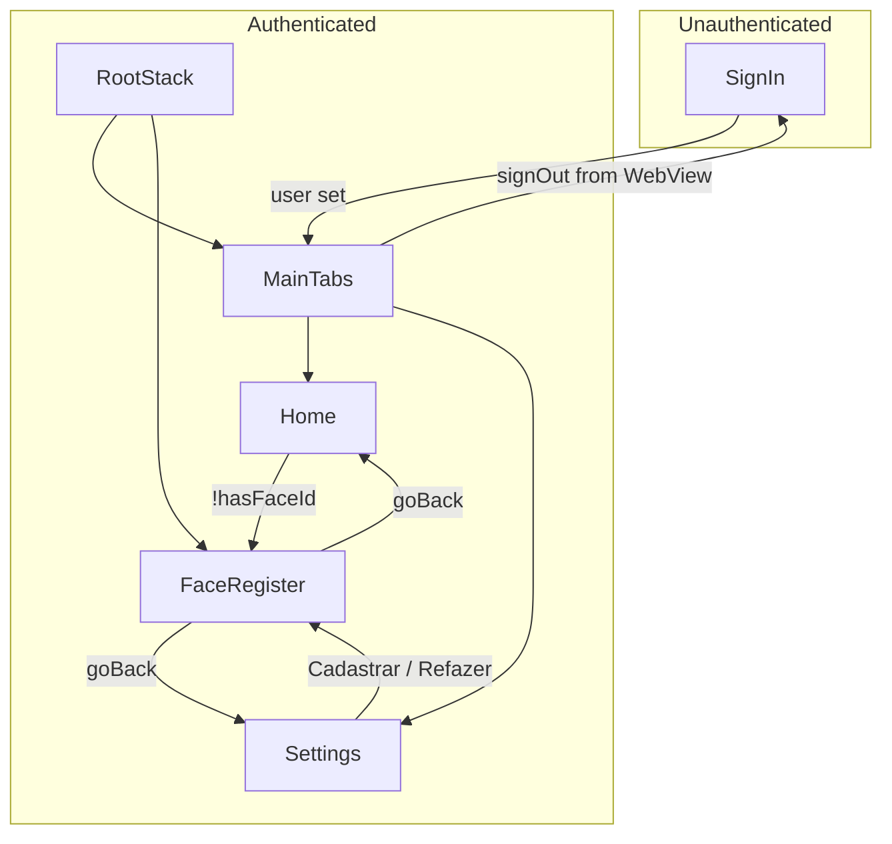

# Legacy App Analysis — conference-cepp

Technical map of the legacy **conference-cepp** Expo application for rebuilding it in **conference-masterclass-2026** using Expo Router and current best practices. This document is exhaustive so another engineer can rebuild the application without opening the legacy repository.

**Source of truth:** Legacy app lives in the `conference-cepp` directory (React Navigation, manual routes, Expo ~53). Target is `conference-masterclass-2026` (Expo Router, file-based navigation, Expo ~55).

---

## 1. Application Overview

### Purpose

The app is an event/conference companion for **"7ª Masterclass em Psiquiatria"** (CEPP). It allows attendees to:

- Log in with CPF (Brazilian tax ID).
- Access the main conference experience inside a WebView (conferencebr.com) with an authenticated hash and auth level.
- Manage profile: change profile photo (camera or gallery) and complete optional facial registration for check-in.
- Receive push notifications (token registered with the backend).

Logout is triggered from the WebView when the user follows a flow that loads a URL containing `logout-app=sucesso`.

### Users

- **Conference attendees** — authenticated by CPF via `GET /v1/?menu=authregister&document={login}`. No sign-up in-app; "Inscreva-se aqui!" opens a WhatsApp link.

### Core Flows

1. **Sign in:** User enters CPF on SignIn → `signIn({ login })` → API returns account → stored in AsyncStorage and AuthContext → app switches to AppRoutes (tabs).
2. **Face registration (optional):** After login, Home calls `checkFaceId(user.document, user.conference_id)`. If no face ID, app navigates to FaceRegister. User takes a selfie, sends to Rekognition; on success, `face_registered` is set in AsyncStorage and user goes back.
3. **Home (WebView):** Loads `https://www.conferencebr.com/...?HASHSOCIO={user.hash_auth}&nivel_autenticacao={1|2}`. Push token is registered on mount. URL changes are monitored for logout and auth-level updates.
4. **Settings:** Profile photo (camera/gallery → upload API), face registration status (from AsyncStorage), and navigation to FaceRegister ("Cadastrar" / "Refazer cadastro facial").
5. **Logout:** Only from WebView: when the loaded URL contains `logout-app=sucesso`, the app calls `signOut()` and clears user; Routes then show AuthRoutes (SignIn).

---

## 2. Navigation Map

### Navigator Types and Structure

| Layer | Type | File | Screens |
|-------|------|------|--------|
| Route switcher | Conditional render | `conference-cepp/src/routes/index.tsx` | `user` ? AppRoutes : AuthRoutes |
| Auth | Native stack | `conference-cepp/src/routes/auth.routes.tsx` | SignIn (SignUp commented out) |
| App root | Native stack | `conference-cepp/src/routes/app.routes.tsx` | MainTabs, FaceRegister |
| Main tabs | Bottom tabs | Same file (MainTabs) | Home, Settings |

- **Auth stack:** `createNativeStackNavigator`, `headerShown: false`, `initialRouteName="SignIn"`.
- **App stack:** `createNativeStackNavigator`, `headerShown: false`; first screen is MainTabs, second is FaceRegister.
- **Bottom tabs:** `createBottomTabNavigator`, `initialRouteName="Home"`. Home tab has a `tabPress` listener that resets the stack to a single Home route. Tab bar uses Feather icons (home, settings) and `theme.colors.primary` for active tint. Titles: "Página inicial", "Ajustes".

### How Navigation Works

- There is no `NavigationContainer` in the route files; it wraps the app in `conference-cepp/App.tsx`. The same container is used for both Auth and App trees; switching is done by conditionally rendering either `AuthRoutes` or `AppRoutes`.
- **Route parameters:** No params are passed in auth. In app: `TabParamList` and `RootStackParamList` use `undefined` for all screens; no typed params are used at runtime.
- **Typing:** `conference-cepp/src/@types/navigation.d.ts` extends `ReactNavigation.RootParamList` from auth's `RootStackParamList` only (SignIn); app routes are typed locally in `app.routes.tsx`.

### Screen Tree (Navigation Flow)



- **Entry points:** SignIn is the only auth screen (entry when no user). Home is the default tab after login. FaceRegister is entered from Home (auto when no face ID) or from Settings (button).
- **Destinations from FaceRegister:** `navigation.goBack()` only (back to Home or Settings).

---

## 3. Screen Documentation

### SignIn

| Field | Detail |
|-------|--------|
| **File** | `conference-cepp/src/screens/SignIn/index.tsx` |
| **Styles** | `conference-cepp/src/screens/SignIn/styles.ts` |
| **Purpose** | CPF login, password recovery, link to sign-up via WhatsApp. |

**Inputs**

- User types CPF in the single `Input` (controlled by `login` state).

**Outputs**

- On successful `signIn({ login })`, the auth hook stores the user in AsyncStorage and context; the Routes component re-renders and shows AppRoutes (user is truthy), so the user sees the tab navigator with Home.
- Password recovery: `api.get('/v1/passrecovery/?document=${login}')`; alert on success or error.
- "Inscreva-se aqui!" opens `Linking.openURL(...)` to a WhatsApp URL (no in-app navigation).

**Main UI elements**

- Logo: `masterclass.png`.
- Title: "Faça seu login".
- `Input` with icon `"file"`, placeholder "CPF", `value={login}`.
- Primary `Button`: "Entrar" → `handleSignIn`.
- Secondary `Button`: "Inscreva-se aqui!" → `navigateToSignUp`.
- `TouchableOpacity`: "Esqueci minha senha" → `handleResetPassword`.
- Footer: "powered by" + `conference_logo.png`.
- Wrappers: `KeyboardAvoidingView`, `ScrollView` with `keyboardShouldPersistTaps="handled"`.

**Navigation**

- **Entry:** App start when `user` is not set (AuthRoutes rendered).
- **Destinations:** None; leaving SignIn is done by setting `user` and re-rendering to AppRoutes.

---

### Home

| Field | Detail |
|-------|--------|
| **File** | `conference-cepp/src/screens/Home/index.tsx` |
| **Styles** | `conference-cepp/src/screens/Home/styles.ts` |
| **Purpose** | WebView of conference site; push token registration; face ID check with redirect to FaceRegister; handle logout and auth-level updates from WebView URL. |

**Inputs**

- `user` from `useAuth()` (used: `hash_auth`, `conference_id`, `document_primary`, `document`).
- `authState` (1 or 2) from AsyncStorage `@conference-cepp:nivel_autenticacao`, loaded on mount and updated when WebView URL contains `nivel_autenticacao_atualizar=2`.

**Outputs**

- **Loader:** `showLoader()` on WebView `onLoadStart`, `hideLoader()` on `onLoadEnd` and when handling logout.
- **Logout:** When `onNavigationStateChange` sees URL with `logout-app=sucesso`, calls `signOut()` and `hideLoader()`.
- **Auth level:** When URL contains `nivel_autenticacao_atualizar=2`, sets AsyncStorage `@conference-cepp:nivel_autenticacao` to `'2'` and local `authState` to 2.
- **FaceRegister:** On mount, `checkFaceId(user.document, user.conference_id)`; if `!hasFaceId`, `navigation.navigate('FaceRegister')`.
- **Push:** On mount, `registerForPushNotificationsAsync()` gets Expo push token and posts to `POST /v1/registerpushtokencell/` with `conference_id`, `document` (document_primary), `push_token`, `type_system_cell` (Platform.OS).

**Main UI elements**

- `SafeAreaView` with `styles.container`.
- Single full-screen `WebView`:
  - `source.uri`: `https://www.conferencebr.com/${APP_TYPE.APP_WEB}/${EVENT_CODE}/BR/?HASHSOCIO=${user?.hash_auth}&ambiente_conference=${CONFERENCE_APP_TYPE.APP}&nivel_autenticacao=${authState}`.
  - `useWebKit={true}`, `cacheEnabled={true}`, `allowsFullscreenVideo`, `allowFileAccess`.
  - `onLoadStart={showLoader}`, `onLoadEnd={hideLoader}`, `onNavigationStateChange={handleWebViewNavigationStateChange}`.

**Navigation**

- **Entry:** Default tab after login (MainTabs initial route is Home).
- **Destinations:** `FaceRegister` when the user has no face ID (programmatic).

---

### Settings

| Field | Detail |
|-------|--------|
| **File** | `conference-cepp/src/screens/Settings/index.tsx` |
| **Styles** | `conference-cepp/src/screens/Settings/styles.ts` |
| **Purpose** | Profile photo (camera or gallery), face registration status, and navigation to FaceRegister. |

**Inputs**

- `user` from `useAuth()` (e.g. `full_name`, `url_profile`, `hash_auth`).
- AsyncStorage key `face_registered` ('true' / other) to show "Check-in facial ativo" vs "Check-in facial pendente". Refreshed on mount and on focus via `useFocusEffect`.

**Outputs**

- Profile image: choosing camera or gallery (expo-image-picker) then `uploadImageToApi(uri, mimeType, user.hash_auth)`; local state `image` is set to the chosen URI for display.
- Navigation: "Cadastrar" or "Refazer cadastro facial" → `navigation.navigate('FaceRegister')`.

**Main UI elements**

- `SafeAreaView`, `View` with profile block:
  - Avatar: `Image` with `uri: image ?? user.url_profile` or Feather `user` icon placeholder.
  - Overlay `TouchableOpacity` with Feather `camera` → `showOptionsAlert` (camera vs gallery).
- `Text`: `user.full_name`.
- Primary action: `TouchableOpacity` "Alterar foto" with camera icon → `showOptionsAlert`.
- Face section:
  - Status: icon (check-circle or alert-circle) + "Check-in facial ativo" or "Check-in facial pendente".
  - If not registered: `TouchableOpacity` "Cadastrar" → `handleFaceRegister`.
  - If registered: `TouchableOpacity` "Refazer cadastro facial" → `handleFaceRegister`.

**Navigation**

- **Entry:** Tab "Ajustes".
- **Destinations:** `FaceRegister`.

---

### FaceRegister

| Field | Detail |
|-------|--------|
| **File** | `conference-cepp/src/screens/FaceRegister/index.tsx` |
| **Styles** | Inline `StyleSheet` in the same file. |
| **Purpose** | Capture a selfie, send it to Rekognition, set `face_registered` in AsyncStorage, then go back. |

**Inputs**

- `user` from `useAuth()`: `document_primary` (cpf), `conference_id`.
- Local state: `image` (captured URI), `loading` (during submit).

**Outputs**

- On success: `AsyncStorage.setItem('face_registered', 'true')`, then Alert "Sucesso!" with single button "OK" that calls `navigation.goBack()`.
- On error (e.g. face not detected): Alert with option "Tirar nova foto" calling `retakePicture`.

**Main UI elements**

- Header: back `TouchableOpacity` (Feather arrow-left + "Voltar") and title "Cadastro de reconhecimento facial".
- If no image: camera section with card, icon, "Vamos começar!", description, "Abrir Câmera" button → `pickImage` (expo-image-picker, front camera).
- If image: preview section with "Revisar foto", image, "Refazer" and "Finalizar Cadastro" buttons. "Finalizar Cadastro" → `handleSend` (calls `registerUser`, then success/error handling).
- Tips section (when no image): "Dicas para uma foto perfeita" and a small grid of tips (eyes, light, only you, no accessories).

**Navigation**

- **Entry:** From Home (auto when `!hasFaceId`) or from Settings (Cadastrar / Refazer).
- **Destinations:** `navigation.goBack()` only (back to previous screen).

---

## 4. Feature Breakdown

| Feature | Screens | APIs / endpoints | Stored state |
|---------|---------|------------------|--------------|
| **Authentication** | SignIn | `GET /v1/?menu=authregister&document={login}` (Bearer EVENT_TOKEN); `GET /v1/passrecovery/?document={login}` | AuthContext `user`; AsyncStorage `@conference-cepp:user` |
| **Event content (WebView)** | Home | None (loads conferencebr.com with query params) | AsyncStorage `@conference-cepp:nivel_autenticacao` ('1' or '2') |
| **Push notifications** | Home | `POST /v1/registerpushtokencell/` (conference_id, document, push_token, type_system_cell) | None (token sent to backend only) |
| **Profile photo** | Settings | `POST https://api.conferencebr.com/v1/savephotoprofile/?hash_socio={userHash}` (FormData, Bearer EVENT_TOKEN) | Local `image` state; server holds URL (user.url_profile) |
| **Face registration** | FaceRegister, Settings (status + entry), Home (redirect) | Rekognition: `POST .../register?cpf=&conference_id=`, `GET .../has-faceid?cpf=&conference_id=` | AsyncStorage `face_registered` ('true') |
| **Auth level** | Home, Auth (signOut sets to '1') | N/A | AsyncStorage `@conference-cepp:nivel_autenticacao` |
| **Loader** | SignIn, Home | N/A | LoaderContext `loading`, `showLoader`, `hideLoader` |

- **Constants used in features:** `EVENT_CODE` (621), `EVENT_TOKEN`, `APP_TYPE.APP_WEB`, `CONFERENCE_APP_TYPE.APP`, `REGISTER_TOKEN_PARAM.EVENTO` (for push endpoint path), `API_REKOGNITION_URL`.

---

## 5. Integrations

| Integration | Where | How |
|-------------|--------|-----|
| **expo-notifications** | Home | Permissions, Expo push token (EAS projectId from Constants), `POST /v1/registerpushtokencell/`. `setNotificationHandler`; `addNotificationReceivedListener` and `addNotificationResponseReceivedListener` (cleaned up on unmount). |
| **expo-image-picker** | FaceRegister, Settings | FaceRegister: camera front, images, allowsEditing. Settings: camera front and media library, aspect [1,1], quality 1. Permissions requested per use. app.json plugin sets permission strings. |
| **react-native-webview** | Home | Single WebView; URL includes HASHSOCIO and nivel_autenticacao; onNavigationStateChange for logout and nivel_autenticacao_atualizar=2. |
| **Linking** | SignIn | `Linking.openURL` to WhatsApp sign-up URL. |
| **Backend APIs** | Multiple | api.conferencebr.com (axios in services/api.ts; profile photo uses fetch in upload-image-to-api.js). rekognition.conferencebr.com (fetch in registerUser.ts and checkFaceId.ts). |
| **Firebase** | Build only | google-services.json present; no Firebase SDK or analytics in app code. |
| **Deep linking** | Legacy: none. New project: scheme | Legacy has no app scheme. conference-masterclass-2026 has `scheme: "conferencemasterclass2026"` in app.json. |

---

## 6. State Management

- **React state:** Local `useState` in each screen (e.g. SignIn: login; Home: authState; Settings: image, faceRegistered; FaceRegister: image, loading).
- **Context:**
  - **AuthProvider** (`conference-cepp/src/hooks/auth.tsx`): `user`, `signIn`, `signOut`, `updateUser`. On mount loads `@conference-cepp:user` from AsyncStorage into state.
  - **LoaderProvider** (`conference-cepp/src/hooks/loader.tsx`): `loading`, `showLoader`, `hideLoader`. Renders full-screen `Loader` when `loading` is true.
  - Composition: `conference-cepp/src/hooks/index.tsx` exports `AppProvider` = `LoaderProvider` → `AuthProvider`.
- **AsyncStorage keys:**
  - `@conference-cepp:user` — JSON string of user object (from API account).
  - `@conference-cepp:nivel_autenticacao` — `'1'` or `'2'`.
  - `face_registered` — `'true'` when face is registered.
- **No Redux, Zustand, or other global stores.**

---

## 7. API Layer

### Axios instance

- **File:** `conference-cepp/src/services/api.ts`
- **Config:** `axios.create({ baseURL: 'https://api.conferencebr.com' })`. No interceptors; auth header is set per request as `Authorization: Bearer ${EVENT_TOKEN}` (EVENT_TOKEN from `conference-cepp/src/constants/index.ts`).

### Main API endpoints

| Method | Path | Used in | Body / query |
|--------|------|---------|--------------|
| GET | `/v1/?menu=authregister&document={login}` | Auth hook (signIn) | Query: document |
| GET | `/v1/passrecovery/?document={login}` | SignIn (handleResetPassword) | Query: document |
| POST | `/v1/registerpushtokencell/` | Home (registerForPushNotificationsAsync) | x-www-form-urlencoded: conference_id, document, push_token, type_system_cell |

### Profile photo (fetch)

- **File:** `conference-cepp/src/screens/Settings/upload-image-to-api.js`
- **URL:** `https://api.conferencebr.com/v1/savephotoprofile/?hash_socio={userHash}`
- **Method:** POST, `Content-Type: multipart/form-data`, body: FormData with `photo_socio` (uri, type, name). Header: `Authorization: Bearer ${EVENT_TOKEN}`.

### Rekognition (fetch only)

- **Base URL:** `https://rekognition.conferencebr.com` (from constants `API_REKOGNITION_URL`).
- **registerUser** (`conference-cepp/src/services/registerUser.ts`): `POST /register?cpf=&conference_id=` with FormData `file` (image). No Bearer header.
- **checkFaceId** (`conference-cepp/src/services/checkFaceId.ts`): `GET /has-faceid?cpf=&conference_id=` with `Content-Type: application/json`. Returns JSON with `hasFaceId`.

---

## 8. UI Architecture

### Reusable components

| Component | Path | Props / behavior |
|-----------|------|-------------------|
| Button | `conference-cepp/src/components/Button/index.tsx` | `variant?: 'primary' \| 'secondary'`, children (string), TouchableOpacity props. |
| Input | `conference-cepp/src/components/Input/index.tsx` | `icon: 'file' \| 'lock' \| 'mail' \| 'user'`, TextInput props. |
| PasswordInput | `conference-cepp/src/components/PasswordInput/index.tsx` | Same icon set; secureTextEntry toggled via eye/eye-off. |
| Loader | `conference-cepp/src/components/Loader/index.tsx` | Full-screen overlay with ActivityIndicator (large, theme.colors.primary). |

Styles for these live in `components/<Name>/styles.ts`; theme from `conference-cepp/src/global/styles/theme.ts`.

### Layout patterns

- **SignIn:** KeyboardAvoidingView (padding on iOS) + ScrollView + centered content + fixed footer.
- **Home, Settings, FaceRegister:** SafeAreaView as root, then content views.
- All screens use screen-local StyleSheet (either in `styles.ts` next to the screen or inline in FaceRegister).

### Styling approach

- **Theme:** `conference-cepp/src/global/styles/theme.ts` — colors (primary, secondary, success, attention, white, text, title, background, etc.) and fonts (Montserrat_400Regular, Montserrat_500Medium, Montserrat_700Bold).
- **Responsive font:** `react-native-responsive-fontsize` `RFValue` in SignIn, Home, Settings, and shared components.
- **Safe areas:** `react-native-iphone-x-helper` `getStatusBarHeight`, `getBottomSpace` in SignIn and Home styles.
- **Icons:** `@expo/vector-icons` (Feather) in all screens and Input/PasswordInput.

---

## 9. App Initialization Flow

1. **Entry:** `conference-cepp/package.json` `main: "node_modules/expo/AppEntry.js"` → Expo loads root `App.tsx`.
2. **App.tsx:** Renders `NavigationContainer` → `AppProvider` → `Routes` → `StatusBar style="dark"`.
3. **AppProvider:** Wraps children with `LoaderProvider` then `AuthProvider` (see `conference-cepp/src/hooks/index.tsx`).
4. **AuthProvider mount:** `loadStorageData()` runs; reads `@conference-cepp:user` from AsyncStorage; if present, parses and sets state so `user` is set. No splash API or delay in code.
5. **Routes:** `const { user } = useAuth()`. First render often has `user` still unset (AsyncStorage read is async) → `AuthRoutes` (SignIn). After `loadStorageData` sets user → re-render → `AppRoutes` (RootStack with MainTabs as first screen, initial tab Home).
6. **Splash:** `app.json` has `splash.image`; `expo-splash-screen` is in dependencies but not used (no `preventAutoHideAsync` / `hideAsync`), so default Expo splash behavior applies until the app is ready.
7. **Once on Home:** `registerForPushNotificationsAsync()`, notification listeners, `checkFaceId` (then navigate to FaceRegister if needed), WebView load with showLoader/hideLoader.

---

## 10. Migration Planning

### Rebuilding with Expo Router

- **Auth guard:** Implement at the root layout (or a wrapper layout). Read auth state (e.g. from the same AuthProvider/AsyncStorage pattern or a thin persistence layer). If no user, redirect to the sign-in route; if user exists, redirect to the app (tabs). Use `router.replace` or conditional rendering of layout children to avoid showing protected routes before auth is resolved.
- **Tabs:** Use a group `(tabs)` with `app/(tabs)/_layout.tsx` defining the bottom tab navigator (Home, Settings). Match titles and icons (e.g. Feather home/settings and "Página inicial" / "Ajustes").
- **Stack vs tabs:** FaceRegister is a stack screen in the legacy app (sibling to MainTabs in the root stack). In Expo Router, options include:
  - A root stack layout with (tabs) and a sibling route `face-register` (e.g. `app/(stack)/_layout.tsx` with Stack, and `app/(stack)/(tabs)/...`, `app/(stack)/face-register.tsx`), or
  - A modal or overlay for `face-register` so it can be reached from both tabs without changing tab structure.
- **Initial route:** Unauthenticated → sign-in (e.g. `/(auth)/sign-in`). Authenticated → `/(tabs)` or `/(tabs)/index` (Home). FaceRegister remains reachable from Home (programmatic) and Settings (button); after success, go back (router.back()).
- **Home tab reset behavior:** Legacy resets the stack to a single Home route on Home tab press. In Expo Router, achieve similar behavior with `router.replace` to the tabs index or by configuring the tab so that pressing Home always shows the root of the tab stack.

### Suggested folder structure (conference-masterclass-2026)

```
app/
  _layout.tsx                 # Root layout: providers, auth-based redirect
  (auth)/
    _layout.tsx               # Optional: stack or single screen
    sign-in.tsx               # Public sign-in screen
  (tabs)/
    _layout.tsx               # Bottom tabs: Home, Settings
    index.tsx                 # Home (WebView)
    settings.tsx              # Settings
  face-register.tsx           # Stack/modal screen (or under (stack) if using stack group)
components/
  Button/
  Input/
  PasswordInput/
  Loader/
constants/
  index.ts                    # EVENT_CODE, EVENT_TOKEN, API_REKOGNITION_URL, enums
hooks/
  auth.tsx
  loader.tsx
  index.tsx                   # AppProvider
services/
  api.ts
  registerUser.ts
  checkFaceId.ts
  upload-image-to-api.js      # or .ts
styles/ or global/styles/
  theme.ts
docs/
  legacy-app-analysis.md      # This document
```

- **Route groups:** Use `(auth)` for unauthenticated and `(tabs)` for main app. FaceRegister can live at `app/face-register.tsx` and be opened with `router.push('/face-register')` and closed with `router.back()`, or live under a `(stack)` group if you prefer a dedicated stack layout.

### Navigation reorganization summary

- Replace the conditional `user ? AppRoutes : AuthRoutes` with a root layout that:
  - Waits for auth hydration (AsyncStorage read) if needed.
  - Redirects to `/(auth)/sign-in` when there is no user.
  - Renders `(tabs)` (and allows navigation to face-register) when there is a user.
- FaceRegister: keep it as a single route reachable from both Home and Settings; no route params required (user comes from context). Use `router.back()` after success.
- Preserve WebView URL construction (HASHSOCIO, nivel_autenticacao) and the same `onNavigationStateChange` logic for logout and auth-level updates.

### Dependencies to add in the new project

- **Runtime:** axios, @react-native-async-storage/async-storage, expo-image-picker, expo-notifications, react-native-webview, qs (for push body).
- **UI / UX:** @expo/vector-icons (or expo vector icons if preferred), react-native-responsive-fontsize (optional; can keep for parity).
- **Constants and config:** Copy EVENT_TOKEN, EVENT_CODE, API_REKOGNITION_URL, APP_TYPE, CONFERENCE_APP_TYPE, REGISTER_TOKEN_PARAM, and ensure EAS projectId is available (expo-constants) for push.
- **No change** to backend base URLs or Rekognition URLs; keep the same API contract and auth header (Bearer EVENT_TOKEN) where used.

---

*End of legacy app analysis. Use this document as the single source of truth for rebuilding the conference-cepp feature set in conference-masterclass-2026 with Expo Router.*
